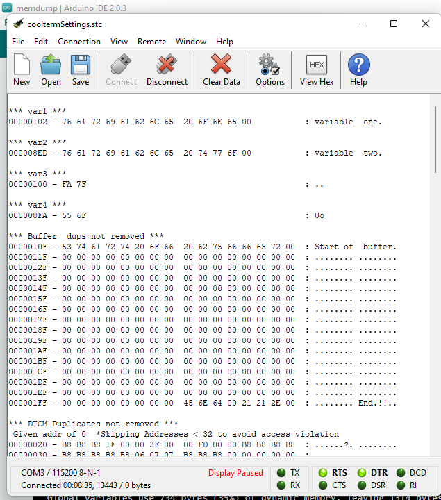

# MemoryHexDump

This is a simple library that dumps memory to whichever Arduino Print object you specify. 

This is really nothing special, as there are probably at least 100 similar code bases that dump memory in Hex.

This code shows 16 bytes per line in HEX and then shows the bytes in ASCII if in proper range else a .

Note: this code does not include anything to work in the PROGMEM area of 8 bit AVR processors. 

The example has been changed to show how this can be used to see how variables are stored in memory but the library is unchanged.

##

The library should be cloned into

C:\{path}\Arduino\libraries\

## API

### RAM

```c++
void MemoryHexDump(Print& out, void const* address, size_t count, bool remove_duplicate_lines, 
	const char *szTitle=NULL, uint32_t max_output_lines=(uint32_t)-1, 
	uint32_t starting_display_addr = (uint32_t)-1 );

```
Dumps memory starting at some address for so many bytes.  It also has an option to 
try to not show duplicate lines. 

- **out** : A reference to any object that is derived from the Print class, such as Serial
- **address** : The memory pointer
- **count** : The count of how many bytes to dump out
- **remove_duplicate_lines**: Should we try to reduce output by not showing several lines that have the same 16 bytes?
- **szTitle** : Optional Title string
- **max_output_lines** : Optional can limit how many lines are output
- **starting_display_addr** : Optional can use different count instead of memory address, used in SDFileDump example


## Output example

The example has been changed to show how this can be used to see how variables are stored in memory.


